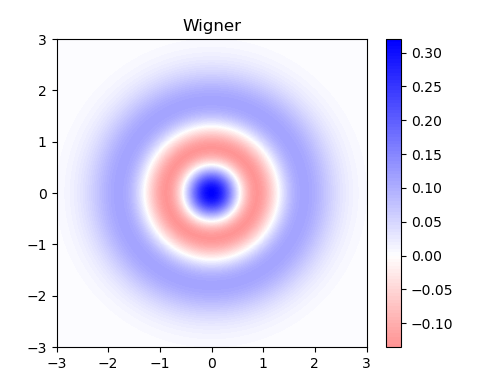
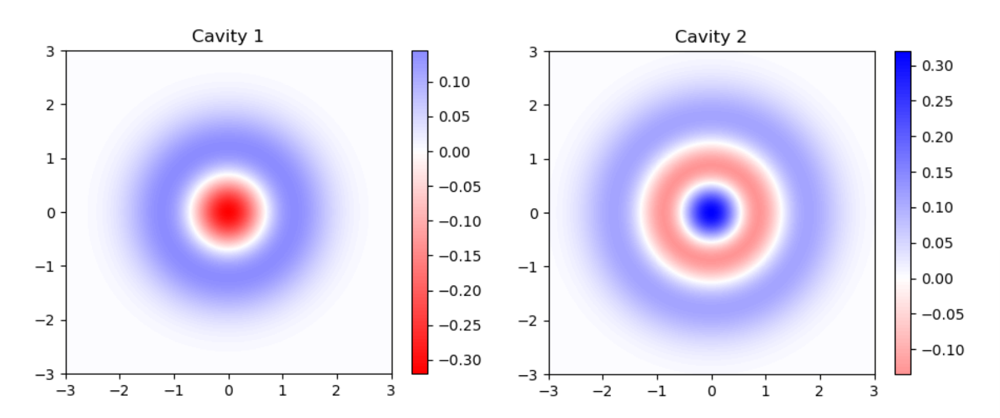

# Wigner plot

In this tutorial we'll go through how to use the `quick_wigner` utility function to plot great Wigner functions in just one line of code.

## Import necessary libraries

For the following examples we'll just use `numpy` and the `quick_wigner` function from `crewmate`.

```python
import numpy as np
from crewmate.utils import quick_wigner
```

## Simple plot

As the name suggests, `quick_wigner` is designed to let users plot a good Wigner function, without going through the hassle of writing a nice plot function. We'll see how it can be used in different cases:

### Qubit-cavity system

Consider a 3-level qubit and a 20-dimensional cavity. Now assume the qubit is the ground state $|g\rangle$ and the cavity is in $|2\rangle$.

```python
# Define qubit and cavity dimensions
q_dim = 3
c_dim = 20

# Define qubit state
g = np.zeros(q_dim)
g[0] = 1
# Define cavity state
fock2 = np.zeros(c_dim)
fock2[2] = 1

# System's state
psi = np.kron(g, fock2)
```

Given psi we can easily plot the Wigner function of the cavity by simply calling the `quick_wigner` function and specifying the dimension of the 2 sub-spaces we are considering (3d qubit and 20d cavity).

```python
quick_wigner(psi, [q_dim, c_dim])
```

<figure markdown>
  { width="500" }
  <figcaption>Wigner plot of the cavity</figcaption>
</figure>

### Cavity-qubit system
Consider the same system as the example above, except this time the tensor product is inverted: instead of having a qubit-cavity system we have a cavity-qubit system.

```python
# Define qubit and cavity dimensions
q_dim = 3
c_dim = 20

# Define qubit state
g = np.zeros(q_dim)
g[0] = 1
# Define cavity state
fock2 = np.zeros(c_dim)
fock2[2] = 1

# System's state
psi = np.kron(fock2, g)
```

By default `quick_wigner` will trace the second sub-system. In the example before the cavity was the second sub-system, so we didn't have to specify anything manually. In this case we need to let the function know that we want the Wigner function of the first sub-system by setting `trace_idx = 0`.

```python
quick_wigner(psi, [c_dim, q_dim], trace_idx=0)
```

### Single cavity
```python
quick_wigner(fock2, c_dim)
```

### Complex systems
`quick_wigner` can be used to plot any sub-system, even in more complex systems, like a 1 qubit 2 cavities setup. The idea is similar to the cavity-qubit case, we just need to specify the correct `trace_idx`. In the example below we'll consider a system in which the qubit is in $|g\rangle$, cavity1 is in $|1\rangle$, and cavity2 is in $|2\rangle$.

```python
# Define qubit and cavity dimensions
q_dim = 3
c_dim = 20

# Define qubit state
g = np.zeros(q_dim)
g[0] = 1
# Define cavity1 state
cavity_1 = np.zeros(c_dim)
cavity_1[1] = 1
# Define cavity2 state
cavity_2 = np.zeros(c_dim)
cavity_2[2] = 1

# System's state
psi = np.kron(g, cavity_1)
psi = np.kron (psi, cavity_2)
```

For a qubit-cavity1-cavity2 system the trace indices are 0 for the qubit, 1 for cavity1, and 2 for cavity2.
```python
# Plot cavity 1
quick_wigner(psi, [q_dim, c_dim, c_dim], trace_idx=1, title="Cavity 1")

# Plot cavity 2
quick_wigner(psi, [q_dim, c_dim, c_dim], trace_idx=2, title="Cavity 2")
```
<figure markdown>
  { width="1000" }
</figure>